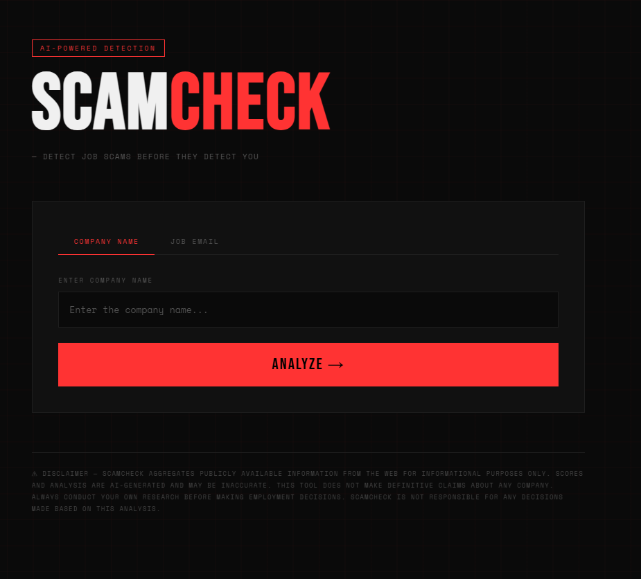

# 🔍 ScamCheck — AI Job Scam Detector

An AI agent that analyzes companies and job emails to detect scams. Paste a company name or job email → agent searches the web, extracts red flags, scores scam risk 0-100, and gives a final recommendation.

## Live Trace
[View LangSmith Trace](https://smith.langchain.com/o/d8bd81ce-ad69-462f-8b67-2bed8101abb4/projects/p/758b3952-8d46-423f-8413-18376701072d?runview=traces&peek=20260524T101045Z019e5977-376c-72a0-b561-a563131fef8e&peeked_trace=20260524T101045739957Z019e5977-376c-72a0-b561-a563131fef8e)

## How It Works

```
User Input (company name or job email)
        ↓
Email Parser Node — extracts company name from email
        ↓
Search Node — 3 Tavily searches (reddit, glassdoor, scam reports)
        ↓
Analysis Node — LLM extracts red flags from search results
        ↓
Scoring Node — LLM scores scam risk 0-100
        ↓
Summary Node — LLM writes final report + recommendation
        ↓
FastAPI → HTML/CSS Frontend
```
## Live Demo
🌐 [https://job-scam-detector-j48h.onrender.com](https://job-scam-detector-j48h.onrender.com)

## Screenshot

## Scam Score
- **0-30** ✅ Looks Legitimate
- **31-60** ⚠️ Proceed with Caution
- **61-100** 🚨 Likely Scam

## Tech Stack

| Layer | Tech |
|---|---|
| Agent Framework | LangGraph |
| LLM | Groq (llama-3.3-70b) |
| Web Search | Tavily API |
| Backend | FastAPI |
| Frontend | HTML / CSS / JS |
| Observability | LangSmith |

## How to Run

```bash
git clone https://github.com/Samarth-S-Shetty/job-scam-detector
cd job-scam-detector

uv venv
.venv\Scripts\activate

pip install langgraph langchain-groq tavily-python fastapi uvicorn python-dotenv
```

Add your keys to `.env`:
```
GROQ_API_KEY=your_key
TAVILY_API_KEY=your_key
LANGSMITH_API_KEY=your_key
LANGSMITH_TRACING=true
LANGSMITH_PROJECT=job-scam-detector
```

```bash
uvicorn main:api --reload
```

Open `http://localhost:8000`

## Example

**Input:** `QuantumLoopAI`

**Output:**
- Scam Score: 15/100
- Verdict: ✅ Looks Legitimate
- Red flags: None significant found
- Summary: UK-based healthtech startup with Series A funding. Legitimate company.

## Disclaimer

ScamCheck aggregates publicly available information for informational purposes only. Scores are AI-generated and may be inaccurate. Always conduct your own research before making employment decisions.